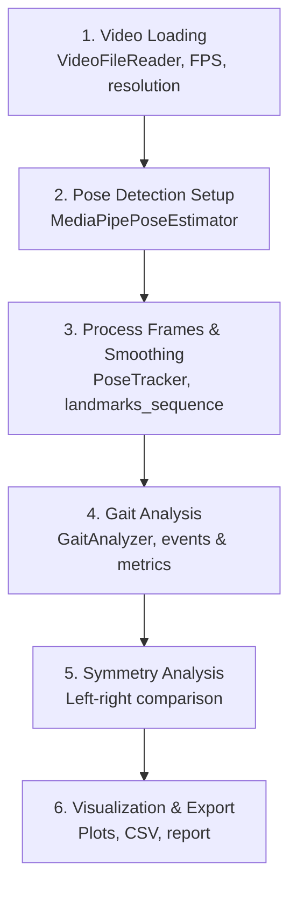

# Gait Analysis using Vision Models

> Alexander Mui · ASDRP mui-group

This project analyzes human gait from video using MediaPipe (33 body landmarks per frame) and derives biomechanical metrics: cadence, stride time, stance/swing phases, joint angles, and left-right symmetry. Results are exported as CSV, plots, and an HTML report.

---

## Table of Contents

- [Gait Analysis using Vision Models](#gait-analysis-using-vision-models)
  - [Table of Contents](#table-of-contents)
  - [Prerequisites](#prerequisites)
  - [Installation](#installation)
  - [Getting the MediaPipe Model](#getting-the-mediapipe-model)
  - [Project Structure](#project-structure)
  - [Quick Start](#quick-start)
  - [Notebook Walkthrough](#notebook-walkthrough)
    - [Stage 1: Video Loading](#stage-1-video-loading)
    - [Stage 2: Pose Detection Setup](#stage-2-pose-detection-setup)
    - [Stage 3: Process Frames \& Smoothing](#stage-3-process-frames--smoothing)
    - [Stage 4: Gait Analysis](#stage-4-gait-analysis)
    - [Stage 5: Symmetry Analysis](#stage-5-symmetry-analysis)
    - [Stage 6: Visualization \& Export](#stage-6-visualization--export)
  - [Output Metrics](#output-metrics)
  - [Development](#development)

---

## Prerequisites

- **Python 3.12+** (`python --version`)
- **uv** for dependency management: `curl -LsSf https://astral.sh/uv/install.sh | sh`
- A video file (sample: `data/runner_example0.mp4`)
- MediaPipe Pose Landmarker model at `data/models/pose_landmarker.task` (see below)

---

## Installation

```bash
git clone <repository-url>
cd gaitanalysis
uv sync

# Optional: dev tools (pytest, ruff, black, mypy)
# uv sync --extra dev
```

Verify:

```bash
uv run python -c "import asdrp; print(asdrp.__version__)"
# Expected: 0.1.0
```

---

## Getting the MediaPipe Model

The pipeline needs Google MediaPipe’s `pose_landmarker.task`. It is not in the repo.

1. Download it from the [MediaPipe Pose Landmarker](https://developers.google.com/mediapipe/solutions/vision/pose_landmarker) docs.
2. Place it at: `data/models/pose_landmarker.task`

You can use another path by setting `PoseEstimationConfig.model_path` in your config.

---

## Project Structure

```
gaitanalysis/
├── asdrp/                    # Main library
│   ├── pipeline.py           # GaitAnalysisPipeline
│   ├── video/                # VideoFileReader, VideoWriter, FrameData
│   ├── pose/                 # MediaPipePoseEstimator, PoseTracker, LandmarkProcessor
│   ├── analysis/             # GaitAnalyzer, StrideAnalyzer, CadenceAnalyzer, SymmetryAnalyzer
│   ├── visualization/        # PoseOverlay, MetricsPlotter, ReportGenerator
│   └── utils/                # PipelineConfig, geometry, smoothing
├── data/
│   ├── runner_example0.mp4   # Sample video
│   ├── models/               # Put pose_landmarker.task here
│   └── outputs/              # Generated CSV, PNG, HTML
├── notebooks/
│   └── gait_analysis.ipynb   # Step-by-step walkthrough
├── pyproject.toml
└── uv.lock
```

`pipeline.py` orchestrates the other modules; lower-level modules do not import from it.

---

## Quick Start

Run a full analysis with the pipeline:

```python
from pathlib import Path
from asdrp import GaitAnalysisPipeline
from asdrp.utils import create_default_config

config = create_default_config(
    video_path=Path("data/runner_example0.mp4"),
    model_path=Path("data/models/pose_landmarker.task"),
    output_directory=Path("data/outputs"),
)
pipeline = GaitAnalysisPipeline(config)
results = pipeline.run()

metrics = results["metrics"]
print(f"Cadence:      {metrics.cadence:.1f} steps/min")
print(f"Stride time:  {metrics.stride_time:.3f} s")
print(f"Symmetry:     {metrics.symmetry_index:.3f}")
```

`pipeline.run()` runs: setup → process_video → analyze_gait → create_visualizations → generate_report, and returns a dict with `metrics`, visualization paths, and report path.

---

## Notebook Walkthrough

The notebook `notebooks/gait_analysis.ipynb` goes through the same pipeline step by step so you can inspect intermediate results.

```bash
uv run jupyter notebook notebooks/gait_analysis.ipynb
```

Stages in the notebook (aligned with the pipeline):

| Stage | Notebook sections | What happens |
|-------|-------------------|--------------|
| 1. Video Loading | §2 | Load video with `VideoFileReader`; inspect FPS, resolution, frame count |
| 2. Pose Detection Setup | §3 | Initialize `MediaPipePoseEstimator`; set detection/tracking confidence |
| 3. Process Frames & Smoothing | §4 | Run pose on each frame; apply `PoseTracker` (Gaussian smoothing); build `landmarks_sequence` (list of per-frame dicts) |
| 4. Gait Analysis | §6 | `GaitAnalyzer` + `StrideAnalyzer`, `CadenceAnalyzer`, `SymmetryAnalyzer`; `analyze(landmarks_sequence)` → `GaitMetrics` (events, cadence, stride time, joint angles, symmetry) |
| 5. Symmetry Analysis | §8 | Left vs right comparison; symmetry metrics and scatter plots |
| 6. Visualization & Export | §5, §7, §9, §10 | Pose overlay on frames; joint angle time series; dashboard; export CSV, report, PNGs |



---

### Stage 1: Video Loading

```python
from asdrp.video import VideoFileReader

reader = VideoFileReader(Path("data/runner_example0.mp4"))
fps = reader.get_fps()
total = reader.get_frame_count()
w, h = reader.get_resolution()
```

`reader.read_frame()` returns a `FrameData`: `image` (BGR NumPy array), `frame_number`, `timestamp`. FPS is used everywhere to convert frame indices to time (e.g. for cadence, stride time).

---

### Stage 2: Pose Detection Setup

```python
from asdrp.pose import MediaPipePoseEstimator

estimator = MediaPipePoseEstimator(
    model_path=Path("data/models/pose_landmarker.task"),
    min_detection_confidence=0.5,
    min_tracking_confidence=0.5,
    running_mode="VIDEO",
)
# Per frame: rgb = cv2.cvtColor(frame_data.image, cv2.COLOR_BGR2RGB)
# landmarks = estimator.estimate(rgb, timestamp=frame_data.timestamp * 1000)
```

Each frame gets a `PoseLandmarks` with 33 keypoints. Lower-body indices used for gait: hip (23, 24), knee (25, 26), ankle (27, 28), heel (29, 30), foot_index (31, 32). Landmarks have normalized (x, y, z), optional world coordinates, and visibility.

---

### Stage 3: Process Frames & Smoothing

The notebook loops over frames: estimate pose → push into `PoseTracker` → get smoothed landmarks → convert to dict and append to `landmarks_sequence`:

```python
from asdrp.pose import PoseTracker, LandmarkProcessor

tracker = PoseTracker(window_size=5, sigma=1.0)
landmarks_sequence = []

for frame_data in ...:
    landmarks = estimator.estimate(rgb, timestamp=ts, frame_number=frame_data.frame_number)
    if landmarks:
        tracker.add_detection(landmarks)
        smoothed = tracker.get_smoothed_landmarks(mode="gaussian")
        if smoothed:
            landmark_dict = LandmarkProcessor.to_dict(smoothed)  # or manual dict from smoothed
            landmarks_sequence.append(landmark_dict)
```

Smoothing reduces jitter; `window_size=5` and `sigma=1.0` are typical. The analyzer expects a list of such per-frame dicts.

---

### Stage 4: Gait Analysis

`GaitAnalyzer` runs the calculators in order; `StrideAnalyzer` finds heel strikes and toe offs, then cadence and symmetry use those events:

```python
from asdrp.analysis import GaitAnalyzer, StrideAnalyzer, CadenceAnalyzer, SymmetryAnalyzer

analyzer = GaitAnalyzer(fps=fps)
analyzer.add_calculator(StrideAnalyzer(fps=fps))
analyzer.add_calculator(CadenceAnalyzer(fps=fps))
analyzer.add_calculator(SymmetryAnalyzer(fps=fps))

metrics = analyzer.analyze(landmarks_sequence)
```

`metrics` is a `GaitMetrics` object: `cadence`, `stride_time`, `stride_length`, `stance_phase_duration`, `swing_phase_duration`, `knee_flexion_max`, `hip_extension_max`, `symmetry_index`, `events` (list of `GaitEvent`). Joint angles per frame can be computed with `LandmarkProcessor.get_joint_angle()` (e.g. knee = angle at knee between hip–knee and knee–ankle vectors).

---

### Stage 5: Symmetry Analysis

`SymmetryAnalyzer` (inside Stage 4) already computes `symmetry_index` from temporal, spatial, and kinematic sub-indices (Robinson’s formula: `SI = 1 - |L - R| / (0.5*(L+R))`). The notebook’s symmetry section (§8) adds left–right comparison and scatter plots (e.g. knee and hip). SI &lt; 0.85 is often worth investigating.

---

### Stage 6: Visualization & Export

Outputs written to `data/outputs/`:

| File | Contents |
|------|----------|
| `gait_metrics.csv` | One row of scalar metrics |
| `joint_angles.csv` | Per-frame knee, hip, ankle angles |
| `gait_analysis_report.txt` | Text summary |
| `pose_visualization.png` | Sample frames with skeleton overlay |
| `knee_angles.png`, `hip_angles.png`, `ankle_angles.png` | Angle time series |
| `knee_symmetry.png`, `hip_symmetry.png` | Left vs right scatter |
| `gait_dashboard.png` | Multi-panel dashboard |

`PoseOverlay` draws the skeleton; `MetricsPlotter` builds the plots; `ReportGenerator` produces the HTML report from `metrics.to_dict()`.

---

## Output Metrics

| Metric | Unit | Typical range |
|--------|------|----------------|
| cadence | steps/min | 160–180 (recreational); elite often 180+ |
| stride_time | s | 0.55–0.75 |
| stride_length | normalized | Depends on video scale |
| stance_phase_duration | s | 0.18–0.30 |
| swing_phase_duration | s | 0.35–0.50 |
| knee_flexion_max | ° | 90–130 |
| hip_extension_max | ° | 160–175 |
| symmetry_index | 0–1 | &gt; 0.90 good; &lt; 0.85 worth checking |

Cadence = heel strikes per minute (both feet). Stride time = time from one heel strike to the next on the same foot. Stance = foot on ground (heel strike → toe off); swing = foot in air. Symmetry &lt; 0.85 can reflect injury, leg length, or strength imbalance.

---

## Development

```bash
uv run pytest
uv run pytest tests/test_stride.py::test_heel_strike_detection
uv run ruff check asdrp/
uv run black asdrp/
uv run mypy asdrp/
```
