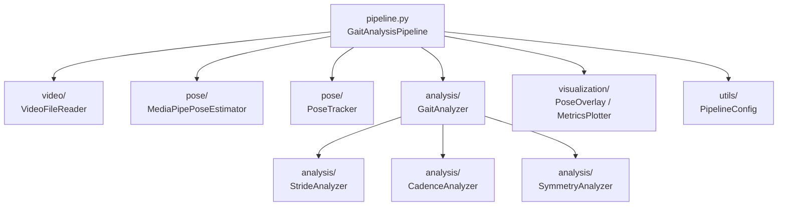
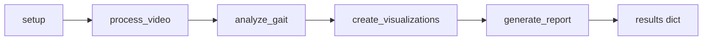
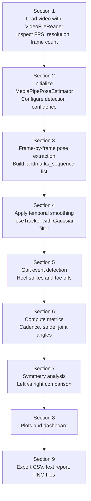
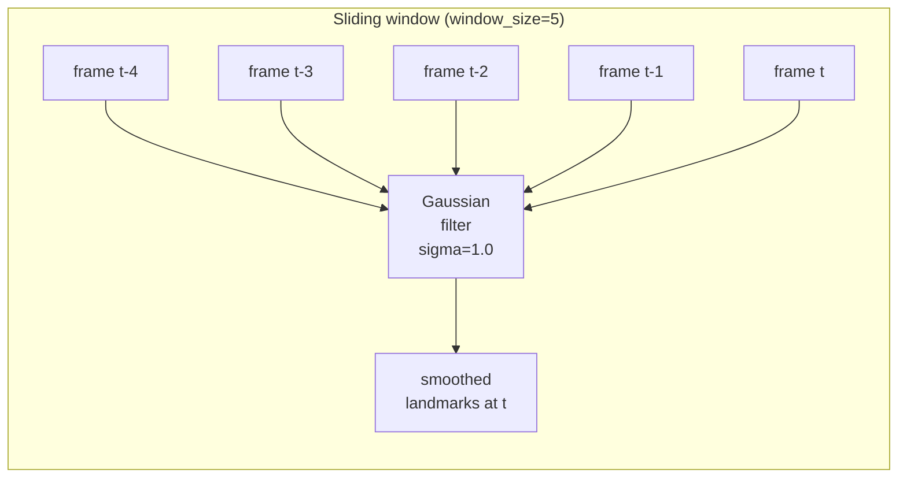
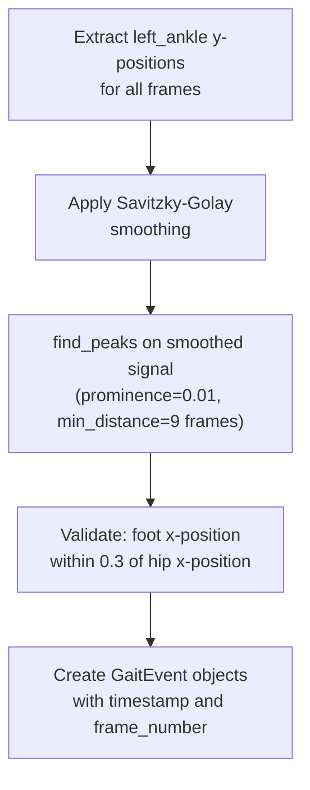
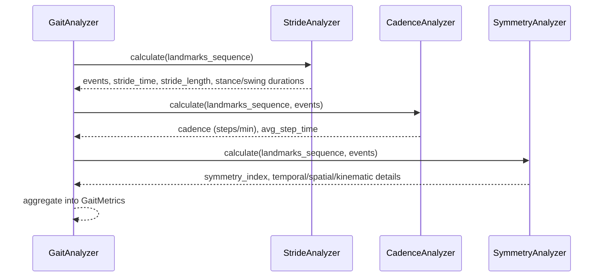
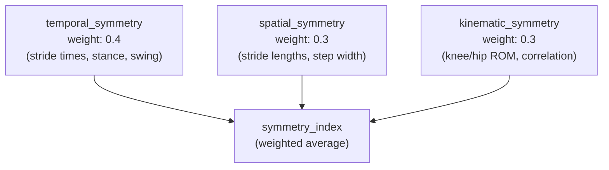

# Gait Analysis using Vision Models

> Alexander Mui
>
> ASDRP mui-group
>
> Sat Mar 14 13:00:00

This project explores analyzing human gait from video. It uses MediaPipe to detect 33 body landmarks per frame, then derives biomechanical metrics including cadence, stride time, stance/swing phase durations, joint angles, and left-right symmetry. Results are exported as CSV files, plots, and an HTML report.

---

## Table of Contents

1. [Prerequisites](#prerequisites)
2. [Installation](#installation)
3. [Getting the MediaPipe Model](#getting-the-mediapipe-model)
4. [Project Structure](#project-structure)
5. [Quick Start](#quick-start)
6. [Notebook Walkthrough](#notebook-walkthrough)
   - [Stage 1: Video Loading](#stage-1-video-loading)
   - [Stage 2: Pose Detection](#stage-2-pose-detection)
   - [Stage 3: Temporal Smoothing](#stage-3-temporal-smoothing)
   - [Stage 4: Gait Event Detection](#stage-4-gait-event-detection)
   - [Stage 5: Metrics Calculation](#stage-5-metrics-calculation)
   - [Stage 6: Symmetry Analysis](#stage-6-symmetry-analysis)
   - [Stage 7: Visualization and Export](#stage-7-visualization-and-export)
7. [Understanding the Output Metrics](#understanding-the-output-metrics)

---

## Prerequisites

- **Python 3.12 or later** (`python --version` to check)
- **uv** for dependency management. Install it with:
  ```bash
  curl -LsSf https://astral.sh/uv/install.sh | sh
  ```
- A running video file (a sample is included at `data/runner_example0.mp4`)
- The MediaPipe Pose Landmarker model file (see [Getting the MediaPipe Model](#getting-the-mediapipe-model))

---

## Installation

Clone the repository and install all dependencies into a virtual environment using `uv`:

```bash
git clone <repository-url>
cd gaitanalysis

# Create the virtual environment and install dependencies
uv sync

# To also install development tools (pytest, ruff, black, mypy)
uv sync --extra dev
```

`uv sync` reads `pyproject.toml` and the lock file `uv.lock` to install exact, reproducible versions of every dependency. The virtual environment is created at `.venv/`.

To verify the installation worked:

```bash
uv run python -c "import asdrp; print(asdrp.__version__)"
# Expected output: 0.1.0
```

---

## Getting the MediaPipe Model

The pose estimation relies on a pre-trained model file (`pose_landmarker.task`) from Google MediaPipe. This file is not included in the repository and must be downloaded separately.

1. Visit the MediaPipe Pose Landmarker documentation and download the model.
2. Place the downloaded file at:
   ```
   data/models/pose_landmarker.task
   ```

The full path the pipeline expects by default is `data/models/pose_landmarker.task`. You can point to a different location by adjusting `PoseEstimationConfig.model_path` when building your config.

---

## Project Structure

The main library lives in the `asdrp/` package (Advanced Sports Data Research Platform). Each subdirectory is a self-contained module:

```
gaitanalysis/
├── asdrp/                    # Main library package
│   ├── pipeline.py           # GaitAnalysisPipeline orchestrator
│   ├── video/                # VideoFileReader, VideoWriter, FrameData
│   ├── pose/                 # MediaPipePoseEstimator, PoseTracker, LandmarkProcessor
│   ├── analysis/             # GaitAnalyzer, StrideAnalyzer, CadenceAnalyzer, SymmetryAnalyzer
│   ├── visualization/        # PoseOverlay, MetricsPlotter, ReportGenerator
│   └── utils/                # PipelineConfig dataclasses, geometry, smoothing
├── data/
│   ├── runner_example0.mp4   # Sample input video
│   ├── models/               # Place pose_landmarker.task here
│   └── outputs/              # Generated results (CSV, PNG, HTML)
├── notebooks/
│   └── gait_analysis_demo.ipynb
├── pyproject.toml
└── uv.lock
```

The relationship between modules flows in one direction: `pipeline.py` imports from all other modules, and no lower-level module imports from `pipeline.py`.



---

## Quick Start

The fastest way to run a complete analysis is through `GaitAnalysisPipeline`:

```python
from pathlib import Path
from asdrp import GaitAnalysisPipeline
from asdrp.utils import create_default_config

config = create_default_config(
    video_path=Path("data/runner_example0.mp4"),
    model_path=Path("data/models/pose_landmarker.task"),
    output_directory=Path("data/outputs"),
)

pipeline = GaitAnalysisPipeline(config)
results = pipeline.run()

metrics = results["metrics"]
print(f"Cadence:      {metrics.cadence:.1f} steps/min")
print(f"Stride time:  {metrics.stride_time:.3f} s")
print(f"Symmetry:     {metrics.symmetry_index:.3f}")
```

`pipeline.run()` executes five stages in sequence and returns a dictionary containing the `GaitMetrics` object, paths to all generated plots, and the path to the HTML report.



---

## Notebook Walkthrough

Open the notebook from the project root:

```bash
uv run jupyter notebook notebooks/gait_analysis_demo.ipynb
```

The notebook walks through the same stages as the pipeline, but exposes each step individually so you can inspect intermediate results. The diagram below shows how the notebook is organized and where each stage feeds into the next:



---

### Stage 1: Video Loading

The notebook opens the video using `VideoFileReader`:

```python
from asdrp.video import VideoFileReader

reader = VideoFileReader(Path("data/runner_example0.mp4"))
fps    = reader.get_fps()           # e.g., 30.0
total  = reader.get_frame_count()   # e.g., 270
w, h   = reader.get_resolution()    # e.g., (1280, 720)
```

Each call to `reader.read_frame()` returns a `FrameData` object with three fields:
- `image`: the frame as a `(H, W, 3)` NumPy array in BGR format
- `frame_number`: integer index starting from 0
- `timestamp`: time in seconds derived from frame number and FPS

**Why this matters:** The FPS value is used throughout the analysis to convert frame indices into real time in seconds. If the FPS is wrong, all time-based metrics (cadence, stride time) will be incorrect.

---

### Stage 2: Pose Detection

`MediaPipePoseEstimator` wraps Google's MediaPipe Pose Landmarker. For each frame, it returns a `PoseLandmarks` object containing the positions of 33 body keypoints.

```python
from asdrp.pose import MediaPipePoseEstimator

estimator = MediaPipePoseEstimator(
    model_path=Path("data/models/pose_landmarker.task"),
    min_detection_confidence=0.5,
    min_tracking_confidence=0.5,
    running_mode="VIDEO",
)

# Convert BGR frame to RGB before passing to MediaPipe
rgb_frame = cv2.cvtColor(frame_data.image, cv2.COLOR_BGR2RGB)
landmarks = estimator.estimate(rgb_frame, timestamp=frame_data.timestamp * 1000)
```

The 33 landmarks follow the MediaPipe indexing scheme. The `PoseLandmarkIndex` enum maps readable names to integer indices. Key lower-body landmarks used in gait analysis are:

| Index | Name | Used for |
|-------|------|----------|
| 23 | `LEFT_HIP` | Hip angle, stride reference |
| 24 | `RIGHT_HIP` | Hip angle, stride reference |
| 25 | `LEFT_KNEE` | Knee flexion angle |
| 26 | `RIGHT_KNEE` | Knee flexion angle |
| 27 | `LEFT_ANKLE` | Heel strike detection |
| 28 | `RIGHT_ANKLE` | Heel strike detection |
| 29 | `LEFT_HEEL` | Ground contact |
| 30 | `RIGHT_HEEL` | Ground contact |
| 31 | `LEFT_FOOT_INDEX` | Toe-off detection |
| 32 | `RIGHT_FOOT_INDEX` | Toe-off detection |

Each landmark has three components:
- `landmarks`: normalized image coordinates `(x, y, z)` where `x` and `y` are in `[0, 1]`
- `world_landmarks`: 3D coordinates in meters, relative to the hip center
- `visibility`: confidence score in `[0, 1]`

The notebook builds up a `landmarks_sequence` list, one entry per frame. Frames where no person was detected contain `None`.

```python
landmarks_sequence = []
while True:
    frame_data = reader.read_frame()
    if frame_data is None:
        break
    rgb = cv2.cvtColor(frame_data.image, cv2.COLOR_BGR2RGB)
    ts  = frame_data.timestamp * 1000  # milliseconds
    lm  = estimator.estimate(rgb, timestamp=ts, frame_number=frame_data.frame_number)
    landmarks_sequence.append(lm)
```

---

### Stage 3: Temporal Smoothing

Raw landmark positions contain frame-to-frame jitter from both natural body movement and detection noise. `PoseTracker` maintains a sliding window of recent detections and returns a smoothed version using a Gaussian filter:

```python
from asdrp.pose import PoseTracker

tracker = PoseTracker(window_size=5, sigma=1.0)

for lm in landmarks_sequence:
    if lm is not None:
        tracker.add_detection(lm)
        smoothed = tracker.get_smoothed_landmarks(mode="gaussian")
```

The Gaussian filter is applied along the time axis (axis 0) across the window. A `window_size` of 5 means the smoother considers the current frame and the 4 frames before it. A larger `sigma` produces a stronger smoothing effect.



Three smoothing modes are available: `"gaussian"` (default, weighted toward recent frames), `"average"` (simple mean), and `"median"` (robust to outliers). The `"gaussian"` mode is appropriate for continuous motion data like running.

The utility functions in `asdrp/utils/smoothing.py` provide lower-level access to the same algorithms (`gaussian_smooth`, `savitzky_golay`, `butterworth_filter`) if you want to smooth derived signals like joint angle time series.

---

### Stage 4: Gait Event Detection

`StrideAnalyzer` identifies two types of events for each foot:

- **Heel strike**: the moment a foot makes contact with the ground
- **Toe off**: the moment a foot leaves the ground

Both are detected by analyzing vertical foot position over time. In image coordinates, `y` increases downward, so a foot touching the ground corresponds to a local maximum (peak) in the `y` signal. The detector uses `scipy.signal.find_peaks` on a Savitzky-Golay smoothed signal:



Each `GaitEvent` stores:
- `event_type`: `GaitEventType.HEEL_STRIKE` or `GaitEventType.TOE_OFF`
- `foot`: `Foot.LEFT` or `Foot.RIGHT`
- `frame_number`: integer frame index
- `timestamp`: time in seconds (`frame_number / fps`)
- `landmark_data`: snapshot of relevant landmarks at that moment

For example, inspecting the first few events:

```python
from asdrp.analysis import StrideAnalyzer

analyzer = StrideAnalyzer(fps=30.0)
# landmarks_sequence_dicts is the list after LandmarkProcessor.to_dict()
results   = analyzer.calculate(landmarks_sequence_dicts)
events    = results["events"]

for event in events[:4]:
    print(event)
# GaitEvent(heel_strike, left, frame=12, t=0.400s)
# GaitEvent(heel_strike, right, frame=27, t=0.900s)
# GaitEvent(toe_off, left, frame=19, t=0.633s)
# GaitEvent(toe_off, right, frame=34, t=1.133s)
```

---

### Stage 5: Metrics Calculation

`GaitAnalyzer` acts as the orchestrator for all metric calculators. You plug in instances of `StrideAnalyzer`, `CadenceAnalyzer`, and `SymmetryAnalyzer`, then call `analyze()` once:

```python
from asdrp.analysis import GaitAnalyzer, StrideAnalyzer, CadenceAnalyzer, SymmetryAnalyzer

analyzer = GaitAnalyzer(fps=30.0)
analyzer.add_calculator(StrideAnalyzer(fps=30.0))
analyzer.add_calculator(CadenceAnalyzer(fps=30.0))
analyzer.add_calculator(SymmetryAnalyzer(fps=30.0))

metrics = analyzer.analyze(landmarks_sequence_dicts)
```

The calculators run in sequence and share detected events. `StrideAnalyzer` runs first and produces `GaitEvent` objects. `CadenceAnalyzer` and `SymmetryAnalyzer` receive those events and build on them.



**Joint angle calculation** is handled by `LandmarkProcessor.get_joint_angle()` and the standalone `calculate_angle()` utility. The method uses the dot product formula:

```
angle = arccos( (v1 . v2) / (|v1| * |v2|) )
```

where `v1` and `v2` are vectors from the vertex landmark outward to the two flanking landmarks. For example, to compute the left knee angle at a specific frame:

```python
import numpy as np
from asdrp.utils import calculate_angle

frame_landmarks = landmarks_sequence_dicts[42]  # frame 42

hip   = np.array([frame_landmarks["left_hip"]["x"],
                  frame_landmarks["left_hip"]["y"],
                  frame_landmarks["left_hip"]["z"]])
knee  = np.array([frame_landmarks["left_knee"]["x"],
                  frame_landmarks["left_knee"]["y"],
                  frame_landmarks["left_knee"]["z"]])
ankle = np.array([frame_landmarks["left_ankle"]["x"],
                  frame_landmarks["left_ankle"]["y"],
                  frame_landmarks["left_ankle"]["z"]])

angle = calculate_angle(hip, knee, ankle)
print(f"Left knee angle at frame 42: {angle:.1f} degrees")
```

---

### Stage 6: Symmetry Analysis

`SymmetryAnalyzer` computes a single `symmetry_index` in `[0, 1]` where `1.0` means perfect left-right balance. It is a weighted combination of three sub-indices:



Each sub-index is derived using Robinson's Symmetry Index formula:

```
SI = 1 - |left - right| / (0.5 * (left + right))
```

For instance, if the left average stride time is `0.62 s` and the right is `0.65 s`:

```
SI = 1 - |0.62 - 0.65| / (0.5 * (0.62 + 0.65))
   = 1 - 0.03 / 0.635
   = 1 - 0.047
   = 0.953
```

A value of `0.953` indicates very good symmetry. Values below `0.85` typically suggest a measurable asymmetry worth investigating.

The kinematic component also computes the Pearson correlation between the left and right knee angle time series. A high correlation (close to 1.0) means both legs are moving in a similar pattern, even if the magnitudes differ slightly.

---

### Stage 7: Visualization and Export

The final notebook sections generate output files in `data/outputs/`:

| File | Contents |
|------|----------|
| `gait_metrics.csv` | Single-row CSV with all scalar metrics |
| `joint_angles.csv` | Per-frame time series of knee, hip, and ankle angles |
| `gait_analysis_report.txt` | Human-readable summary |
| `pose_visualization.png` | Sample frames with skeleton drawn on top |
| `knee_angles.png` | Left and right knee angle over time |
| `hip_angles.png` | Left and right hip angle over time |
| `ankle_angles.png` | Left and right ankle angle over time |
| `knee_symmetry.png` | Scatter plot of left vs right knee angles |
| `hip_symmetry.png` | Scatter plot of left vs right hip angles |
| `gait_dashboard.png` | Multi-panel summary dashboard |

The `PoseOverlay` class draws skeleton connections and landmark dots on a copy of each frame using OpenCV. `MetricsPlotter` wraps matplotlib to produce the angle time series and symmetry plots. `ReportGenerator` builds an HTML file from the `GaitMetrics.to_dict()` output.

---

## Understanding the Output Metrics

| Metric | Unit | Typical range (recreational runner) |
|--------|------|--------------------------------------|
| `cadence` | steps/min | 160 to 180 |
| `stride_time` | seconds | 0.55 to 0.75 |
| `stride_length` | normalized units | depends on video scale |
| `stance_phase_duration` | seconds | 0.18 to 0.30 |
| `swing_phase_duration` | seconds | 0.35 to 0.50 |
| `knee_flexion_max` | degrees | 90 to 130 |
| `hip_extension_max` | degrees | 160 to 175 |
| `symmetry_index` | 0 to 1 | above 0.90 is considered good |

**Cadence** is total heel strikes per minute across both feet. Elite runners typically exceed 180 steps/min. Increasing cadence by 5 to 10% is a common intervention for overuse injuries because it reduces peak ground reaction force.

**Stride time** is the time from one heel strike to the next heel strike of the same foot (one complete gait cycle). It is the reciprocal of stride frequency.

**Stance phase** is when the foot is on the ground (heel strike to toe off). **Swing phase** is when the foot is in the air (toe off to next heel strike). In running, stance typically accounts for about 35 to 40% of the gait cycle.

**Symmetry index** values below 0.85 are worth investigating. Common causes include prior injury, leg length discrepancy, and muscle strength imbalances.

---

## Development Commands

```bash
# Run all tests
uv run pytest

# Run a single test function
uv run pytest tests/test_stride.py::test_heel_strike_detection

# Lint
uv run ruff check asdrp/

# Format
uv run black asdrp/

# Type check
uv run mypy asdrp/
```
